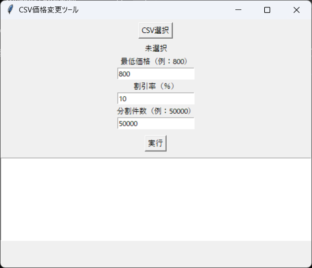
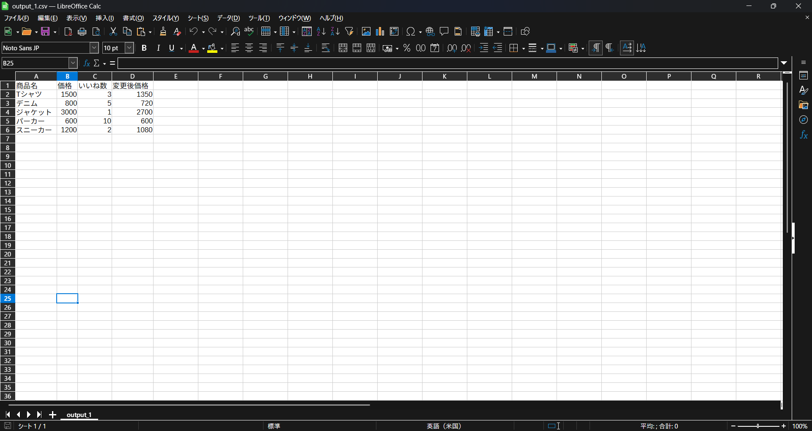

★CSV価格変更ツール★

CSVデータの価格を条件に応じて自動で変更し、指定件数ごとに分割して出力するツールです。
手作業で行っていた価格調整やデータ分割をまとめて処理できるように作成しました。
※本ツールはサンプル仕様です。実運用に合わせたカスタマイズ対応可能です。

■ 想定用途

・EC出品データの価格一括変更  
・CSVの大量データ処理  
・手作業の削減・ミス防止  

■ 機能

・CSVファイルの読み込み  
・指定した価格以上の商品のみ値下げ  
・割引率の設定  
・指定件数ごとにCSVを分割出力  
・GUI操作対応（ファイル選択・条件入力・実行）

■ 使用方法

1. アプリを起動  
2. CSVファイルを選択  
3. 最低価格・割引率・分割件数を入力  
4. 実行ボタンを押す  

処理完了後、outputフォルダに結果が出力されます。

■ 入力データ例

商品名,価格,いいね  
Tシャツ,1500,3  
デニム,800,5  
ジャケット,3000,1  

■ 処理内容

・指定した価格以上 → 割引適用  
・指定未満 → そのまま  

■ 画面イメージ

■ 出力

・価格変更後のCSV  
・指定件数ごとに分割（例：output_1.csv など）

■ 出力イメージ

■ 作成背景

大量の出品データを手作業で調整していたため、
作業時間短縮とミス削減を目的に作成しました。

■ 注意事項

・サンプルデータで動作確認しています  
・実運用時はデータ形式に合わせて調整してください  

■ 今後の改善

・複数条件（いいね数など）の追加  
・フォルダ単位処理対応  
・UI改善

